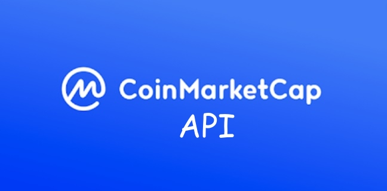

   

## Introduction

Api for coinmarketcap, where it is possible to obtain information on daily quotes, Currencies, most quoted pairs and any information provided by CoinMarketcap charts

## Install 

download this repository at the root of your project or use NPM to install this library in your Node project.

```sh
~$ npm install coinmarketcap-api --save
```

## import

To use this library, it is necessary to import and build it into your project's index file or wherever you want to use it.

```js
import marketcap from "./index.js";

/*
If necessary, you can define the API version you want to use and the data path you want to get.
*/
var coin = new marketcap();

(async () => {
     // var coins = await coin.all()
     // var coins = await coin.exchangeMap('binance')
     var coins = await coin.coinMap('bitcoin')
     console.log(coins)
})();

```


### Contact Dev

>- @victorRatts: Telegram
